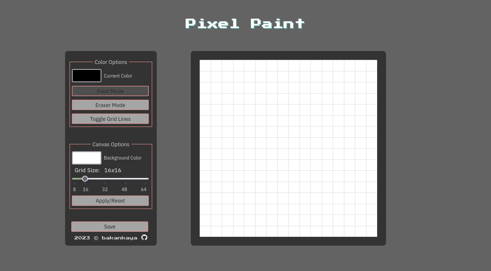

# pixel-paint

An etch-a-sketch like website to create pixel art!

This project is started to follow [Odin Project](https://www.theodinproject.com/lessons/foundations-etch-a-sketch) as a learning project. This was one of the final tasks to finish learning JavaScript before learning frameworks.

Things that I plan on implement:

- auto fill
- zoom in/out
- shading
- save file option

And some ideas to improve:

- colorpicker to take from canvas
- recently used colors as a menu option
